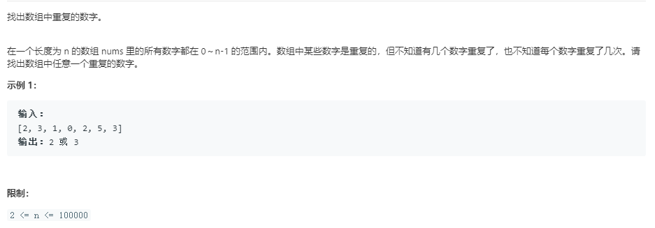

解法1，时间复杂度O(n),空间复杂度O(1)

```java
class Solution { 
    public static int findRepeatNumber(int[] nums) { 
        int i = 0;   
        int temp = 0;   
        //1.要知道循环的次数，这里唯一不变的是必须要遍历整个数组  
        while(i < nums.length){  
            if(nums[i] != i){   
                if(nums[i] != nums[nums[i]]){   
                    temp = nums[i];       
                    nums[i] = nums[nums[i]];    
                    //2.注意这里交换的次序，nums[i]在进行交换后数据已经发生了 
                    //变化，因此不要写成         
                    //nums[nums[i]] = temp;  
                    nums[temp] = temp;   
                }         
                else         
                    return nums[i];  
            }       else{    
                i++;    
            }   
        }    
        return -1; 
    }
}
```

解法2，时间复杂度O(n),空间复杂度O(n)。提示，利用字典进行测试

