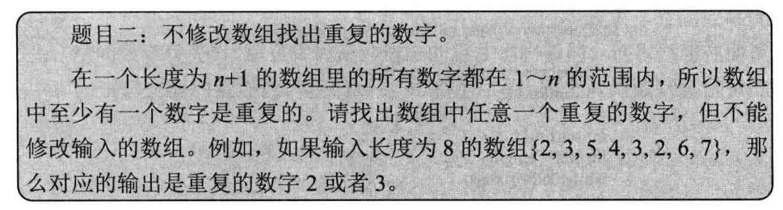
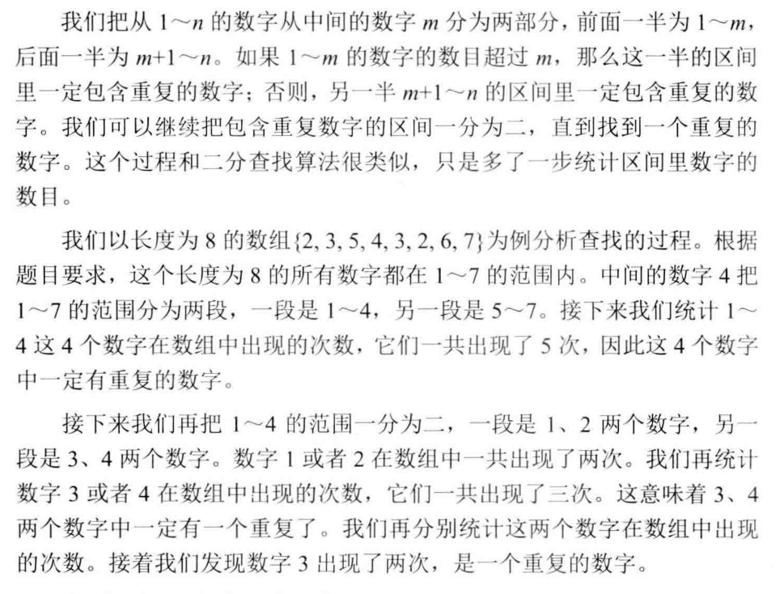
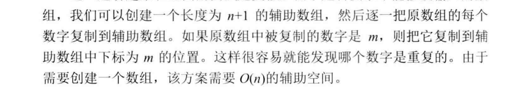

**解法1：**



**代码实现：**

```java
public static int getRepeatNum(int[] nums,int low,int high){   
    int middle = (low + high) / 2;  
    //1.解递归的条件不好写   
    if(low==middle){    
        if(isRepeat(nums,low,middle))    
            return low;    
        else         
            return high; 
    }   
    else if(isRepeat(nums,low,middle)){ 
        //2.递归调用的返回值不好处理,直接return就可以了  
        return getRepeatNum(nums,low,middle);  
    }    //3.n+1的数组长度，1...n的数据肯定会存在重复数据，因此不需要二次判断 
    else {     
        return getRepeatNum(nums,middle+1,high);   
    }  
} 

public static boolean isRepeat(int[] nums,int low, int high){ 
    int repeatNum = 0;  
    for(int i = 0; i < nums.length; i++){  
        repeatNum += (nums[i] >= low && nums[i] <= high)?1:0; 
    }   
    return (repeatNum > (high - low + 1)) ? true:false;
}
```

**算法复杂度分析**：总共递归log2N次，每次需要比较N次，因此时间复杂度为0(nlog2n)。空间复杂度为O（1）。

**解法2：**



**算法复杂度分析**：时间复杂度O（n），空间复杂度为O（n）。